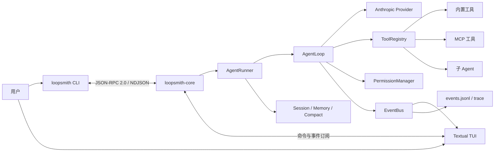

# LoopSmith

LoopSmith 是一个使用 Python 构建的本地 AI Agent 运行时。它将 Agent 核心作为常驻守护进程运行，并通过类型化 IPC 同时服务 CLI 与 TUI 客户端，完整实现从用户目标、模型推理、工具调用、权限审批到会话持久化和事件回放的执行闭环。

项目按照 `stage/s0` 到 `stage/s7` 拆分为渐进式阶段分支，既可以直接运行最终版本，也适合按阶段学习一个 Agent 系统如何从最小骨架演进为支持 Skills、Subagents 与 MCP 的完整运行时。

## 架构概览



`loopsmith-core` 负责真正的任务执行。CLI 和 TUI 只是客户端，因此关闭前端不会天然破坏 Core 的运行边界，未来也可以在不改动 Agent 内核的情况下接入新的客户端。

## 核心亮点

### 1. 守护进程与多客户端架构

- Core 基于 `asyncio.start_server` 监听本机 TCP 端口。
- CLI、TUI 与 Core 通过 JSON-RPC 2.0 消息通信，每行一个 NDJSON 数据帧。
- 客户端可以订阅运行事件，服务器只向匹配的订阅者推送消息。
- 支持后台启动、状态检查、停止和前台调试两种运行方式。

### 2. Pydantic v2 类型化协议

- 命令、响应和事件均建模为 Pydantic v2 类型。
- 使用 `type` 字段与 `Discriminator` 构建可判别联合类型。
- 新增协议消息时可以获得解析校验、静态类型推断和明确的错误边界。
- [`WIRE_PROTOCOL.md`](./WIRE_PROTOCOL.md) 由模型定义自动生成，避免文档与代码漂移。

### 3. ReAct Agent 循环与流式调用

- `AgentLoop` 驱动 plan → act → observe 循环，直到模型完成目标或达到步数上限。
- 支持 Anthropic 流式响应、工具调用、工具结果回填和 extended thinking block 续传。
- 网络流中断时针对连接类错误进行最多 3 次指数退避重试。
- System prompt 与工具 Schema 使用 prompt caching，降低多步骤任务的重复输入成本。

### 4. 会话记忆与上下文压缩

- Session 持久化保存消息历史、运行记录和 Agent 主动维护的 notes。
- 每次调用后统计上下文使用比例，并将 token 使用情况发布为事件。
- 支持 `/compact` 手动压缩，也可以按阈值触发自动压缩。
- 长工具结果会按配置截断，避免单次输出快速耗尽上下文窗口。

### 5. 工具权限管理

- 所有工具调用统一经过 `PermissionManager`。
- 策略层支持默认允许、默认拒绝、规则允许和规则拒绝。
- Bash 命令访问工作目录之外的路径时会强制请求确认，不能被普通允许规则绕过。
- TUI 内直接显示审批控件，权限决策与 Agent 循环通过事件协作。

### 6. Subagents 与事件桥接

- `spawn_agent` 可以创建具有独立上下文的子 Agent。
- 支持前台等待和后台并行运行，并通过 `agent_result` 查询结果。
- 支持 planner、executor、reviewer 等角色配置与工具白名单。
- 子 Agent 的 token、步骤和工具事件会桥接到父 EventBus，由 TUI 分层展示。

### 7. Skills 机制

Skill 使用 Markdown front matter 描述名称、用途、System Prompt 和允许调用的工具，无需修改 Python 代码即可扩展 Agent 行为。

```markdown
---
name: review
description: 审查代码质量并给出可执行建议
allowed_tools:
  - read_file
  - list_dir
  - bash
---

请检查 $ARGUMENTS，重点关注正确性、可维护性和测试覆盖。
```

Skill 按以下优先级查找，同名时高优先级覆盖低优先级：

1. `.loopsmith/skills/`：项目本地
2. `~/.loopsmith/skills/`：用户全局
3. `src/loopsmith/core/skills/builtin/`：内置

TUI 中输入 `/` 可以搜索并补全已注册的 Skill。

### 8. MCP 客户端

- 支持通过 `stdio` 或 TCP 启动和连接外部 MCP Server。
- 使用 JSON-RPC 2.0 调用 `tools/list` 发现工具，通过 `tools/call` 执行工具。
- MCP 工具会适配为统一的 `BaseTool`，注册后与内置工具使用相同的调用路径。
- 支持异步请求匹配、超时处理、进程退出检测和 TCP/SOCKS 代理依赖。

### 9. Textual TUI 与全链路可观测性

- LLM token 在单个流式组件中累积，完成后渲染为 Markdown。
- 工具调用、权限审批和子 Agent 运行以独立区块实时展示。
- 支持 `/compact`、Skill 斜杠补全、运行回放和键盘交互。
- EventBus、`events.jsonl` 与分层 trace 共同记录 IPC、事件和 LLM 数据流。

## 技术栈

| 层次 | 技术 | 用途 |
|---|---|---|
| 语言与运行时 | Python 3.12、asyncio | 异步并发、事件循环和守护进程 |
| LLM SDK | Anthropic SDK ≥ 0.25 | 流式生成、工具调用、prompt caching |
| 数据建模 | Pydantic v2 | 配置校验、IPC 消息和可判别联合类型 |
| IPC | TCP、JSON-RPC 2.0、NDJSON | Core 与多个客户端之间的类型化通信 |
| 终端 UI | Textual ≥ 0.75、Rich | 响应式 TUI、Markdown 与实时事件渲染 |
| HTTP 客户端 | HTTPX ≥ 0.28.1、SOCKS | MCP TCP 通信和代理支持 |
| 配置 | TOML、python-dotenv | 分层配置和本地环境变量加载 |
| 持久化 | JSONL、JSON、Markdown | Session、Event、Trace 与 Notes |
| 测试 | pytest、pytest-asyncio | 单元测试和双进程集成测试 |
| 质量工具 | Ruff、Mypy strict | Lint、导入排序和严格静态类型检查 |
| 构建工具 | uv、Hatchling | 依赖管理、虚拟环境和 Python 打包 |

## 快速开始

### 环境要求

- Python `3.12.x`
- [uv](https://docs.astral.sh/uv/)
- Anthropic API Key

### 安装

```bash
git clone git@github.com:zhouwanmengxinghe/LoopSmith.git
cd LoopSmith
uv sync
```

复制环境变量模板：

```bash
# macOS / Linux
cp .env.example .env

# Windows PowerShell
Copy-Item .env.example .env
```

在 `.env` 中至少配置：

```dotenv
ANTHROPIC_API_KEY=sk-ant-...
LOOPSMITH_LLM_DEFAULT_MODEL=claude-sonnet-4-6
```

### 启动与使用

后台启动 Core：

```bash
uv run loopsmith core start
uv run loopsmith core status
uv run loopsmith ping
```

执行一次任务：

```bash
uv run loopsmith run --goal "读取项目结构并总结核心模块"
```

进入多轮聊天或启动 TUI：

```bash
uv run loopsmith chat
uv run loopsmith-tui
```

停止 Core：

```bash
uv run loopsmith core stop
```

开发时也可以在单独的终端前台运行 Core：

```bash
uv run loopsmith-core
```

## 常用命令

| 命令 | 说明 |
|---|---|
| `uv run loopsmith --version` | 查看版本 |
| `uv run loopsmith --help` | 查看 CLI 帮助 |
| `uv run loopsmith ping` | 验证 Core 连通性 |
| `uv run loopsmith chat` | 启动多轮终端会话 |
| `uv run loopsmith run --goal "..."` | 执行一次 Agent 目标 |
| `uv run loopsmith-tui` | 启动 Textual TUI |
| `uv run loopsmith-tui --replay <RUN_ID>` | 在 TUI 中回放历史运行 |
| `uv run loopsmith trace` | 查看 Trace |
| `uv run loopsmith trace --follow` | 持续追踪新记录 |
| `uv run loopsmith trace --layer llm` | 按 IPC、Event 或 LLM 层过滤 |

## 配置体系

配置优先级从低到高为：

```text
内建默认值
  → ~/.loopsmith/config.toml
  → .loopsmith/config.toml
  → 项目 .env
  → 系统环境变量
```

示例 `.loopsmith/config.toml`：

```toml
[core]
host = "127.0.0.1"
port = 7437

[agent]
max_steps = 20

[llm]
default_model = "claude-sonnet-4-6"
router = "static"

[permission]
timeout_s = 60

[compaction]
auto_threshold = 0.8
tool_result_limit = 8000
tool_result_keep = 4000

[[mcp.servers]]
name = "example"
transport = "stdio"
command = "your-mcp-server"
args = []
```

完整配置项和运维说明见 [`RUNBOOK.md`](./RUNBOOK.md)。

## 项目结构

```text
LoopSmith/
├── src/loopsmith/
│   ├── cli/                 # CLI 入口与子命令
│   ├── tui/                 # Textual 终端界面
│   └── core/
│       ├── agents/          # 子 Agent 角色配置
│       ├── bus/             # 命令、事件与 JSON-RPC envelope
│       ├── compact/         # 上下文预算与压缩
│       ├── events/          # 进程内 EventBus 与事件持久化
│       ├── llm/             # LLM Provider 与流式响应模型
│       ├── mcp/             # MCP Client、Server Manager 和工具适配
│       ├── memory/          # 分层记忆加载
│       ├── permissions/     # 工具权限策略、审批与持久化
│       ├── session/         # 会话模型与存储
│       ├── skills/          # Skill 加载器与内置 Skills
│       ├── subagent/        # 子 Agent 与后台任务
│       ├── task/            # Agent 任务管理
│       ├── tools/           # 工具协议、注册表和内置工具
│       ├── trace/           # 分层 Trace
│       └── transport/       # TCP Server、Client 与事件广播
├── tests/
│   ├── unit/                # 单元测试
│   └── integration/         # 双进程与真实链路集成测试
├── scripts/                 # 协议文档生成脚本
├── WIRE_PROTOCOL.md         # 自动生成的 IPC 协议文档
└── RUNBOOK.md               # 配置、运维与排障手册
```

## 阶段分支

| 分支 | 学习主题 |
|---|---|
| `stage/s0` | 项目骨架、配置系统与协议契约 |
| `stage/s1` | 单进程 Agent 最小闭环 |
| `stage/s2` | Core 守护进程、CLI/TUI 客户端与 IPC |
| `stage/s3` | 自主规划、任务工具、事件流与 Trace |
| `stage/s4` | Session、Thread、Notes 与多轮会话 |
| `stage/s5` | 工具权限审批、失败分类与持久化策略 |
| `stage/s6` | 上下文水位、结果截断与 Compaction |
| `stage/s7` | Skills、Subagents、MCP 与多 Agent 编排 |

可以从最小阶段开始逐步阅读：

```bash
git switch stage/s0
git switch stage/s1
```

## 开发与验证

```bash
# 代码规范
uv run ruff check src tests scripts

# 严格类型检查
uv run mypy src

# 单元测试
uv run pytest tests/unit -v

# 全部测试
uv run pytest tests -v

# 检查协议文档是否与代码同步
uv run python scripts/gen_protocol_doc.py --check
```

修改 `core/bus` 中的命令或事件模型后，需要重新生成协议文档：

```bash
uv run python scripts/gen_protocol_doc.py
```

## License

本项目使用 [MIT License](./LICENSE)。
